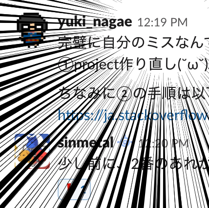
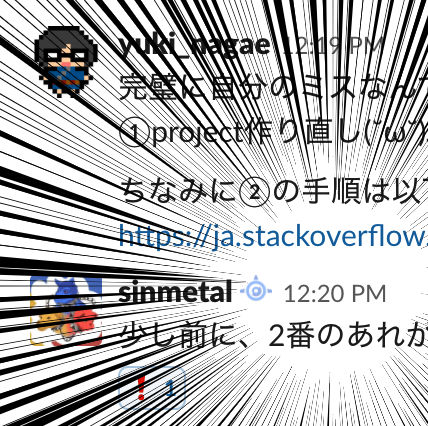

<!-- $theme: gaia -->
<!-- template: gaia -->

## 学習行動データ分析基盤
## Learning Record Store（LRS）
## 開発事例

### @yukinagae

<!-- page_number: false -->

---

# 自己紹介


- 永江悠紀 @yukinagae
- データサイエンティスト (python/go)
- グロービス（教育・MBAの会社） 2018/8〜今
- 経歴
  - 元Java/Scalaエンジニア
  - （突然）オーストラリアでデータ分析を勉強
  - 今はデータ分析基盤の構築・開発（goやGCP）
- 最近の趣味はベイズ統計モデリング

<!-- page_number: true -->

---

# 今日話すこと

1. ユーザの学習行動データを集めたい気持ち
1. LRS (Learning Record Store) とは？
1. システム構成どうする？
1. まとめ


<!-- page_number: true -->

---

# ですが、
# 今日本当に話したいことは

<!-- page_number: true -->

---

# （時間があれば）
# 開発時のしくじり話

<!-- page_number: true -->

---

# なので

<!-- page_number: true -->

---


# どんどんいきます

<!-- page_number: true -->

---

# 1. ユーザの学習行動データを集めたい気持ち

<!-- page_number: true -->

---

# （昔）教育のデジタル化以前

TODO: 絵

- 紙の資料
- 研修や学習は基本的に学校や研修センター


<!-- page_number: true -->

---

# （今）教育のデジタル化以後

TODO: 絵

- 資料はIT化されている
- リモートで研修や学習ができる
- 家や通勤中でも動画コンテンツなどで学習が可能


<!-- page_number: true -->

---

## やりたいこと

TODO: 絵

- パーソナライズされた学習を提供したい
- より効果のある学習をアシストしたい
- 学習プロセス自体を評価したい（行動の変容）
- etc

<!-- page_number: true -->

---

# ユーザの学習行動データを
# 活用しよう

<!-- page_number: true -->

---

# そのためにデータ基盤が必要

<!-- page_number: true -->

---

# 2. LRSとは？

<!-- page_number: true -->

---

# LRS概要

TODO: 絵

- xAPIというデータ形式に則り、学習行動（Learning Record）を蓄積するデータベースのこと

<!-- page_number: true -->

---

# xAPI（データ形式）

- 学習行動を主語、動詞、目的物のjson形式で記述する規格
- xAPI形式に準拠することで、別々のサービス上での学習行動を横断して分析ができる

<!-- page_number: true -->

---

# 具体的にはこういうの

```json
{
  "actor":{
    "objectType":"Agent",
    "name":"yukinagae",
    "mbox":"yuki.nagae1130@gmail.com"
  },
  "verb":{
    "id":"watch"
  },
  "object":{
    "objectType":"Activity",
    "id":"[ある学習動画のURL]"
  },
  "timestamp":"2019-03-07T12:32:34"
}
```

<!-- page_number: true -->

---

## このxAPIデータからわかること

- あるユーザ `yukinagae` は `yuki.nagae1130@gmail.com` のメールアドレスを持っており、
- `2019/03/07の12:32:34` に、
- `[ある学習動画のURL]` を `watch（観た）`

<!-- page_number: true -->

---

こういうxAPIデータをひらすらためると、ユーザの学習プロセスがすべてわかる

<!-- page_number: true -->

---

# 3. アーキテクチャ設計

<!-- page_number: true -->

---

# Go + GCP

TODO: 絵

<!-- page_number: true -->

---

# このシステム構成の理由

- TODO: a
- TODO: b
- TODO: c

<!-- page_number: true -->

---

# ここからおまけ

<!-- page_number: true -->

---

# GCPではまった事例集

- DataflowがGCSにファイル作る時にtempファイル作っちゃう問題（tempもOCN投げちゃう）
- PubSubがOCN二回投げる（at least once）
- BigQueryのスキーマを後から変更（カラム削除等）はできない件
- GAEのDefault Service Accountを一回間違えて削除しちゃうと復旧できない問題

<!-- page_number: true -->

---

# どう解決する？

いろいろやってみた

- Googleのissueトラッカー
- stackoverflow


<!-- page_number: true -->

---

# 結局

- [GCPUG](https://gcpug.jp) のslackですべて解決(｀・ω・´)


<!-- page_number: true -->

---

お？(｀・ω・´)



<!-- page_number: true -->

---

おおおぉぉぉぉぉぉぉぉぉぉ！！！



<!-- page_number: true -->

---

# 1分で回答がくる優しい世界
# それが GCPUG のslack

<!-- page_number: true -->

---

## ご清聴ありがとうございました

<!-- page_number: true -->

---

# 参考資料

- [xAPI.com](https://xapi.com)
- [あらゆる経験を集積するための仕様「Experience API」のメモ](https://qiita.com/61503891/items/fedefbc5d322b9eb1d3d)
- [elc-gh/xAPI-Spec_ja](https://github.com/elc-gh/xAPI-Spec_ja/blob/master/xAPI_ja.md)
- [まずデータをためましょう 〜ラーニングアナリティクスに必要なことと最新動向〜](https://www.nii.ac.jp/csi/openforum2016/track/pdf/20160526_LA1_3_nagai.pdf)
- [企業内教育において最も気になる「LRSについての5つの質問」](http://edu.infosign.co.jp/blog/lrs-5)