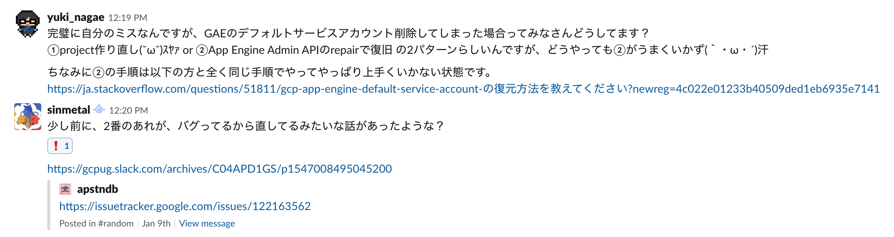
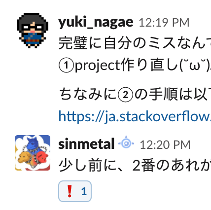

<!-- $theme: gaia -->
<!-- template: gaia -->

# 学習行動データ分析基盤Learning Record Store（LRS）開発事例

### @yukinagae

<!-- page_number: false -->

---

# 自己紹介

- 永江悠紀 @yukinagae
- グロービス 2018/8〜
- データサイエンティスト (python/go)
- 経歴
  - 元Java/Scalaエンジニア
  - オーストラリアでデータ分析を勉強
  - LRS（データ分析基盤）の構築・開発 (go/GCP)
- 最近はベイズ統計モデリングに興味ある(˘ω˘)ｽﾔｧ

<!-- page_number: false -->

---

# Agenda

1. LRS (Learning Record Store) とは？
2. データ設計: xAPI
3. アーキテクチャ選定: Go/GCPによる開発・構築
4. 全体像
5. 

---

# 1. LRSとは？

<!-- page_number: true -->

---

xAPIというデータ形式に則り、学習行動（Learning Record）を蓄積するデータベースのこと

<!-- page_number: true -->

---

# 2. xAPIとは？

<!-- page_number: true -->

---

- 学習行動を主語、動詞、目的物のjson形式で記述する規格
- xAPI形式に沿ったデータが溜められている場所をLRS(Learning record store）と呼ぶ
- xAPI形式に準拠することで、別々のサービス上での学習行動を横断して分析ができる

<!-- page_number: true -->

---

# GCPではまった事例集

- DataflowがGCSにファイル作る時にtempファイル作っちゃう問題（tempもOCN投げちゃう）
- PubSubがOCN二回投げる（at least once）
- BigQueryのスキーマを後から変更（カラム削除等）はできない
- GAEのDefault Service Accountを復旧できない問題

<!-- page_number: true -->

---

# どう解決する？

- stackoverflow
- Googleのissueトラッカー

<!-- page_number: true -->

---

# 結局

- [gcpug](https://gcpug.jp) のslackで解決(˘ω˘)ｽﾔｧ

<!-- page_number: true -->

---

1分で回答がくる優しい世界

<!-- page_number: true -->

---

# 参考資料

- [xAPI.com](https://xapi.com)
- [あらゆる経験を集積するための仕様「Experience API」のメモ](https://qiita.com/61503891/items/fedefbc5d322b9eb1d3d)
- [まずデータをためましょう 〜ラーニングアナリティクスに必要なことと最新動向〜](https://www.nii.ac.jp/csi/openforum2016/track/pdf/20160526_LA1_3_nagai.pdf)
- [企業内教育において最も気になる「LRSについての5つの質問」](http://edu.infosign.co.jp/blog/lrs-5)