<!-- $theme: gaia -->

# ==本当に簡単なkaggleの始め方==

### @yukinagae

<!-- page_number: false -->

---

# 自己紹介

- 永江悠紀 @yukinagae
- グロービス 2018/8〜
- データサイエンティスト(Python/Go)
- 経歴
  - 元Java/Scalaエンジニア
  - オーストラリアでデータ分析を勉強 → 今に至る
- 最近はベイズ統計モデリングに興味ある(˘ω˘)ｽﾔｧ

<!-- page_number: false -->

---

# Agenda

1. kaggleとは？
2. kaggleの仕組み
3. やってみた(｀・ω・´)

<!-- page_number: true -->

---

# ==1.== kaggleとは？

---

### 世界最大の機械学習・データ分析の
### コンペを主催するプラットフォーム

# 

---

# つまり

---

<!-- *template: invert -->

# データサイエンティストの
# 世界最強を決める大会

---

## kaggleの規模

* ユーザ数: 50万以上
* 国: 190カ国以上

らしい(｀・ω・´)

---

# ==2.== kaggleの仕組み

---

## 大まかな流れ

1. 主催者（企業など）がコンペを主催する
	a. データを準備
	b. 問題を定義する
2. 参加者は様々な手法を使ってベストなモデルを構築し、予測を提出する
	* スコアやランキングが分かる
4. 主催者は、精度が高い予測に賞金を払う

---

# ということで

---

# ==3.== 早速kaggleをやってみた(｀・ω・´)

---

## 1. コンペを選ぶ

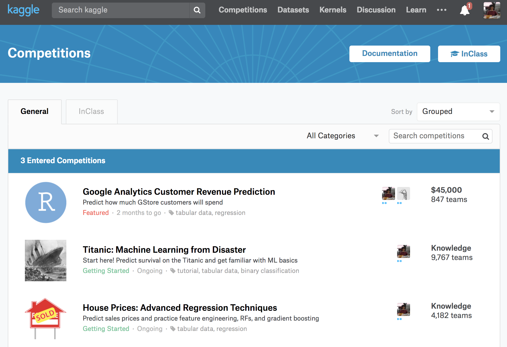

---

例えばこのコンペ(｀・ω・´)

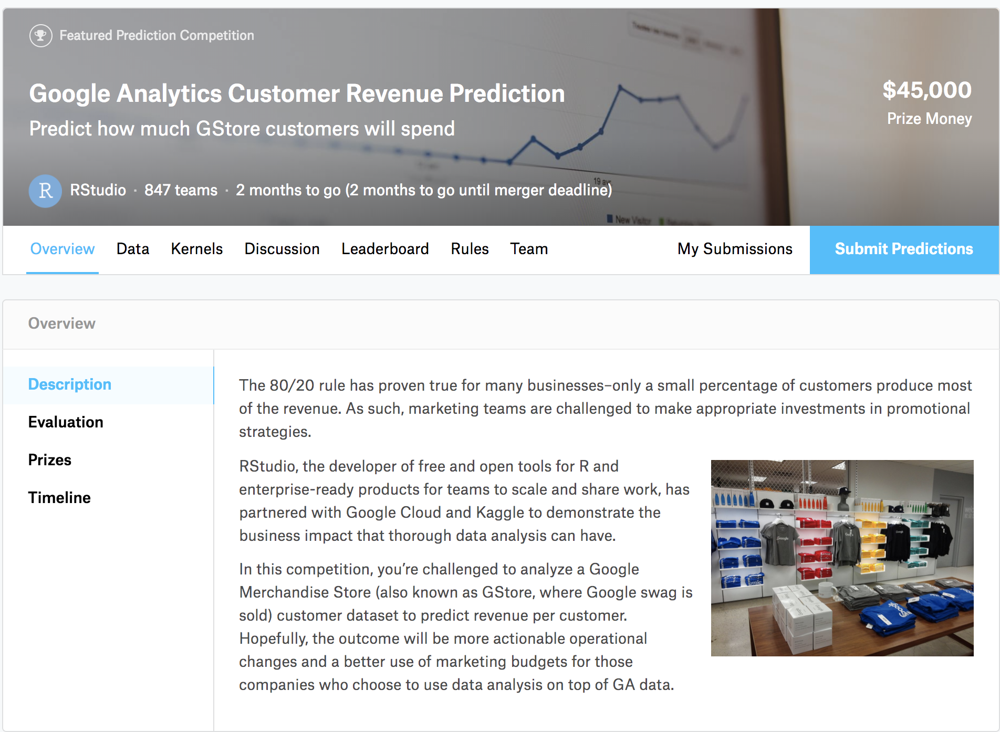

---

## 2. コンペの内容を読む

1. 概要: 大まかに把握
1. 評価指標: これが一番大事(｀・ω・´)
1. 賞金: できればほしいよね
1. 期限: 時間厳守
1. データ: だいたいCSVファイル（BigQueryも）

---

## 3. 他の参加者から学ぶ
	
1. コード（kernel）
1. ディスカッション（discussion）

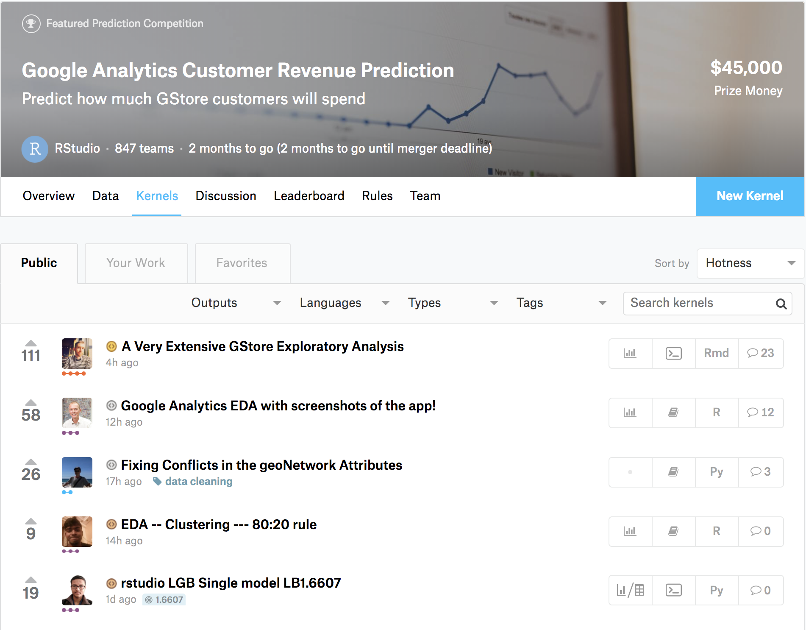

---

いろんな人がコードを載せてくれてるので助かる

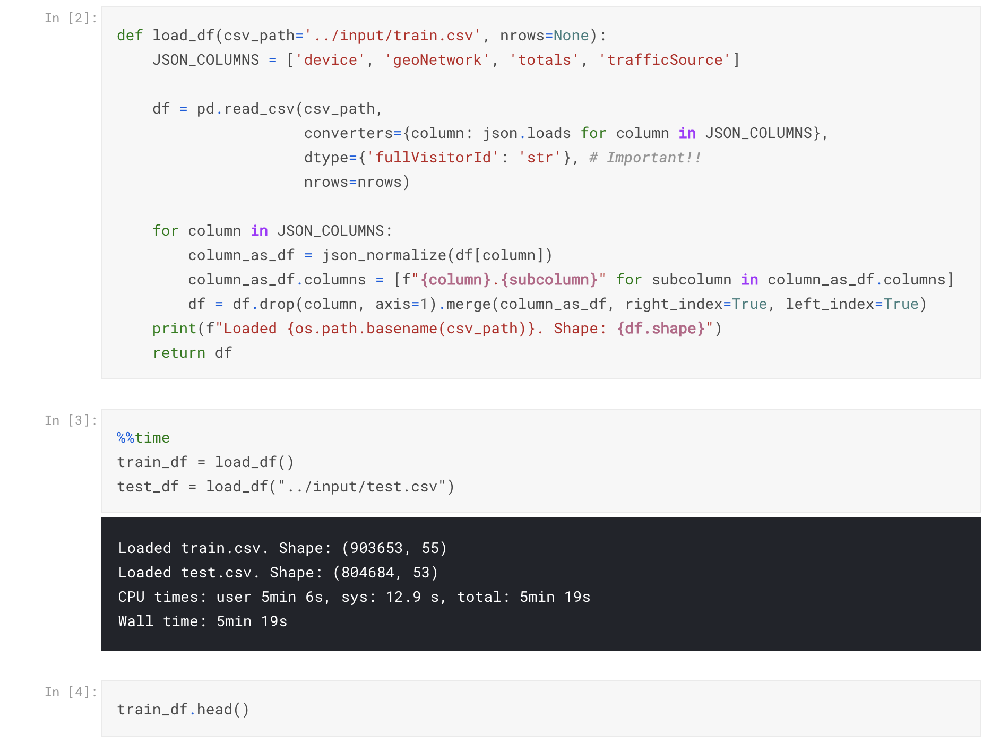

see: [Simple Exploration+Baseline - GA Customer Revenue | Kaggle](https://www.kaggle.com/sudalairajkumar/simple-exploration-baseline-ga-customer-revenue)

---

## 4. 他の参加者の方法を真似てみる
コードをパクってローカルPCで実行するだけの簡単なお仕事(｀・ω・´)

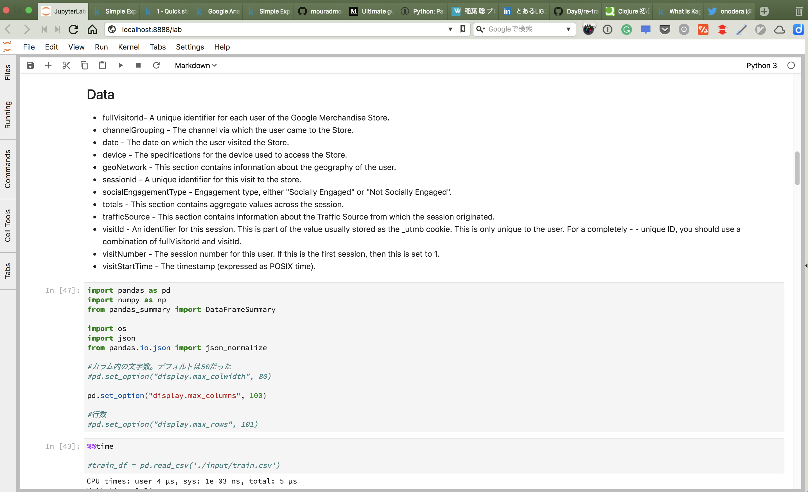

---

## 5. 助け合う <= New!
ちょうどライブラリのバージョンで上手く動作しなかったので、上手くいった方法を教え合う(｀・ω・´)

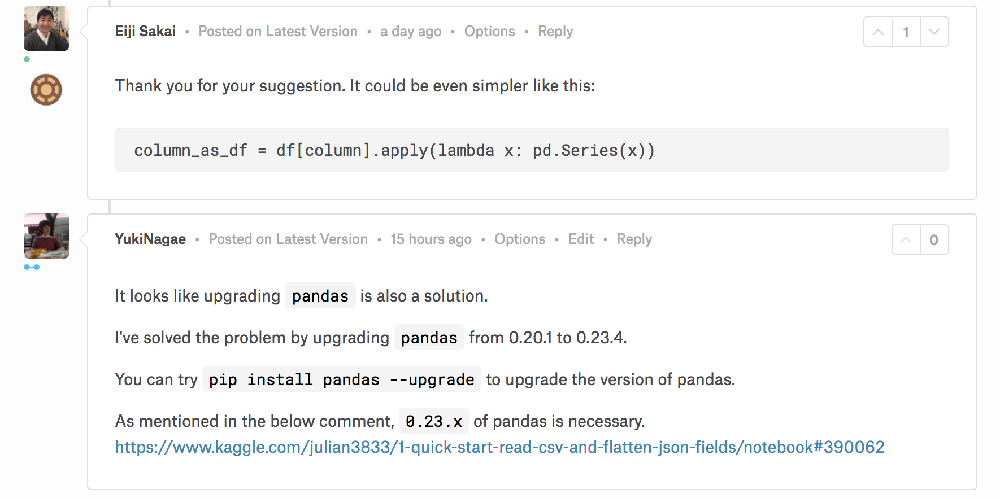

---

## 6. めんどくさいので人のコードをforkする

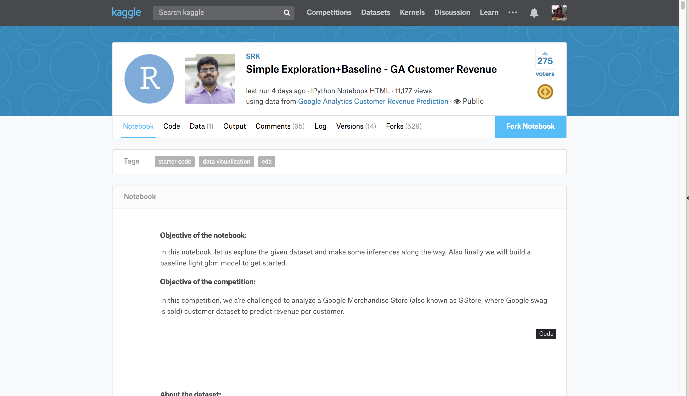

---

forkしたコードを実行するだけ(｀・ω・´)

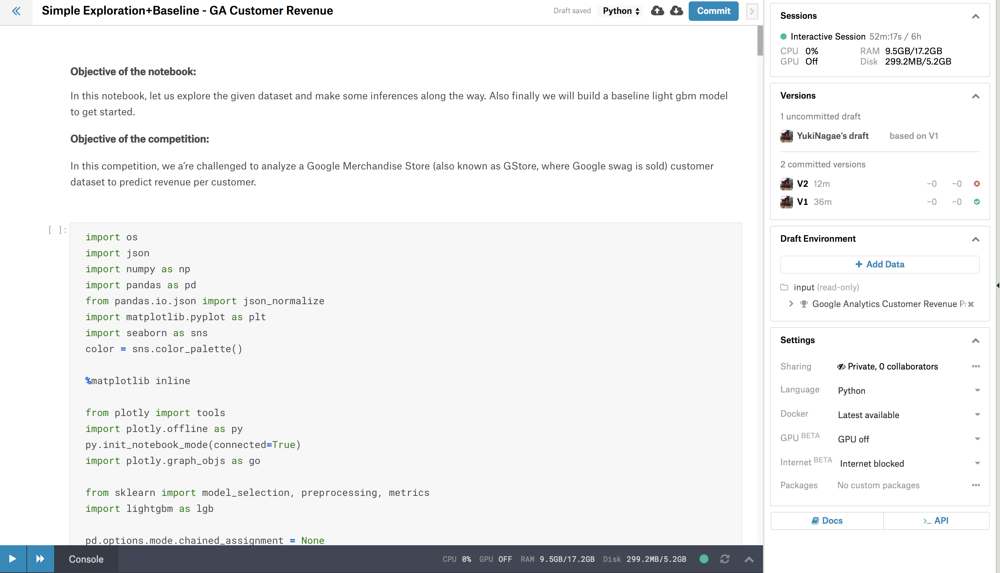

---

実行中

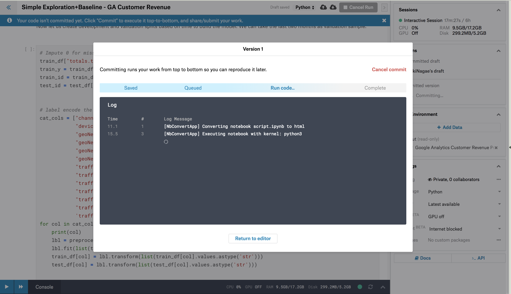

---

## 7. 予測を提出する

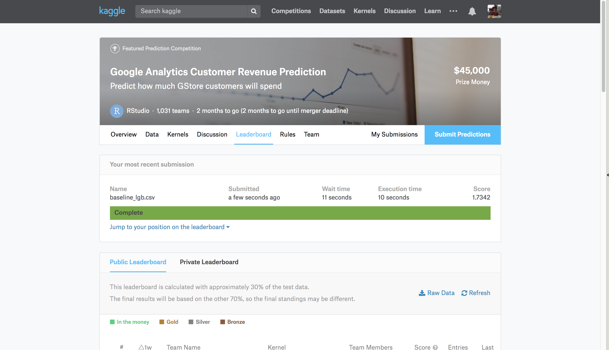

---

## 8. スコアとランクを確認

689位（全1,031チーム）

ちーん(｀・ω・´)

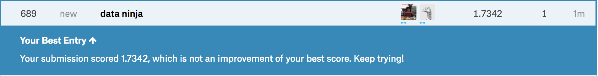

---

# 結局言いたいのは

---

<!-- *template: invert -->

# パクった後が勝負

---

# まとめ

* kaggleはデータサイエンティストのNo.1を決める大会
* とりあえず人のコードをパクって頑張る
* kaggleは沼(｀・ω・´)

---

# 参考資料

* [Kaggle - Wikipedia](https://en.wikipedia.org/wiki/Kaggle)
* [What is Kaggle, Why I Participate, What is the Impact?](https://www.kaggle.com/getting-started/44916)
* [fast.ai · Making neural nets uncool again](http://www.fast.ai)
* [deeplearning.ai: Announcing new Deep Learning courses on Coursera](https://medium.com/@andrewng/deeplearning-ai-announcing-new-deep-learning-courses-on-coursera-43af0a368116)

---

# おわり(｀・ω・´)

## ようこそkaggle沼へ

---

# 最後にいちおう

## We're hiring!

# 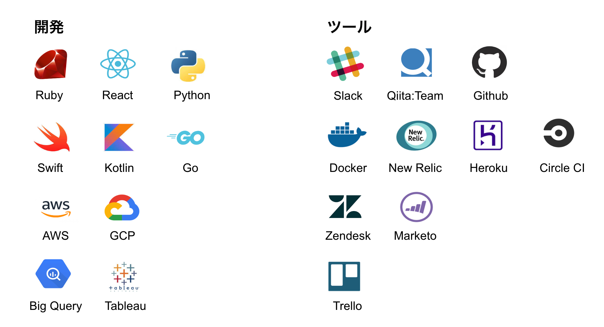